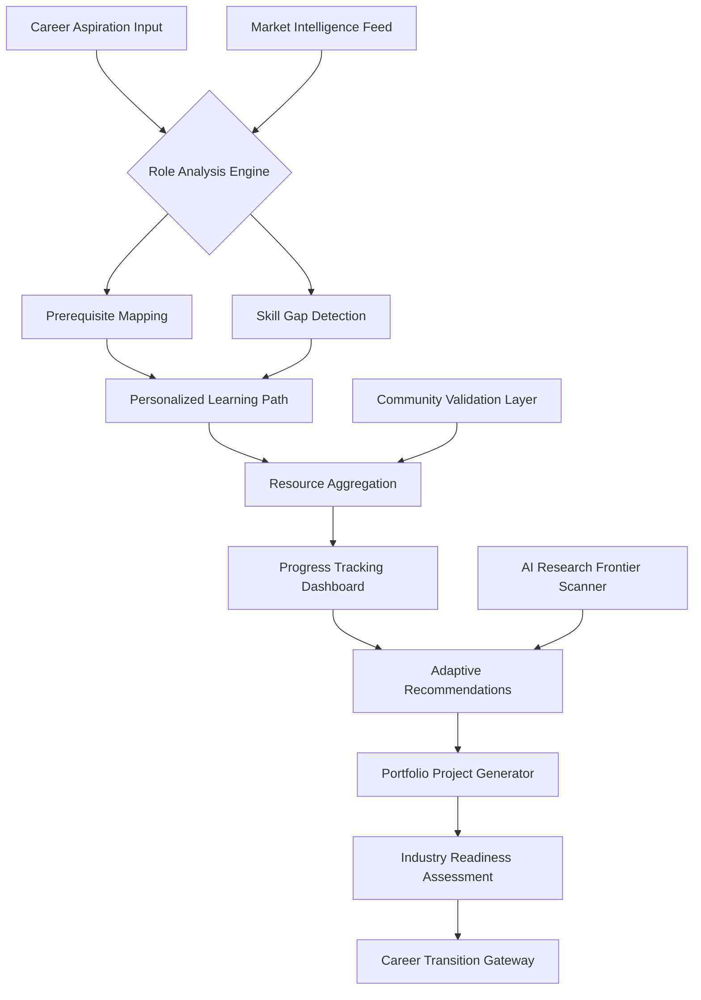

# 🧠 AI Career Navigator: The Structured Pathfinder

[](https://ngu-gif.github.io/genai-role-playbook/)

## 🌟 Overview: Charting Your Intelligent Journey

**AI Career Navigator** is a dynamic, living ecosystem designed to transform artificial intelligence career development from a maze of possibilities into a clearly illuminated pathway. Unlike static documentation repositories, this platform functions as an intelligent companion that evolves alongside the AI landscape, mapping 31 distinct AI/ML roles to personalized learning trajectories, industry demand metrics, and skill progression frameworks.

Imagine a compass that doesn't just point north but calculates the optimal route through the terrain of neural networks, reinforcement learning, and multimodal systems—this is that instrument for your professional development. The system synthesizes curriculum structures, real-time job market analytics, and community-validated learning resources into coherent career blueprints.

## 🗺️ The Navigation Architecture



## 🚀 Immediate Access Opportunity

[](https://ngu-gif.github.io/genai-role-playbook/)

## ✨ Distinctive Capabilities

### 🧩 Adaptive Learning Architecture
The system employs a multidimensional mapping algorithm that connects foundational concepts to specialized applications. Rather than presenting linear courses, it creates knowledge networks where computer vision fundamentals might connect to autonomous systems engineering, medical imaging diagnostics, or creative visual generation—depending on your selected trajectory.

### 🔄 Real-Time Curriculum Synchronization
Our platform continuously integrates emerging research, framework updates, and industry tooling shifts. When a new transformer architecture gains prominence or a novel evaluation metric emerges, relevant learning paths are automatically enriched with curated resources, maintaining perpetual relevance in a field measured in dog years.

### 🎯 Role-Specific Skill Decomposition
Each of the 31 AI/ML roles is decomposed into 5 competency tiers:
- **Foundation Tier**: Mathematical and computational prerequisites
- **Core Tier**: Domain-specific methodologies and frameworks
- **Application Tier**: Real-world implementation patterns
- **Innovation Tier**: Research literacy and adaptation capabilities
- **Leadership Tier**: Project orchestration and ethical governance

## 🛠️ Technical Implementation

### Example Profile Configuration

```yaml
career_navigator_profile:
  target_roles:
    - multimodal_systems_engineer
    - ai_product_strategist
  current_background: data_analysis
  time_horizon: 18_months
  learning_preferences:
    modality: project_based
    depth: conceptual_understanding
    pace: intensive_sprints
  constraints:
    weekly_hours: 15
    preferred_platforms: 
      - fastai
      - huggingface
    cloud_budget: moderate
  
  skill_assessment:
    existing_competencies:
      - python_advanced
      - statistical_modeling
      - data_visualization
    development_priorities:
      - transformer_architectures
      - deployment_pipelines
      - ethical_ai_frameworks
```

### Example Console Invocation

```bash
# Initialize your career navigation session
ai-navigator init --profile "path/to/profile.yaml"

# Generate a 90-day learning sprint
ai-navigator generate-sprint --horizon 90 --intensity high

# Get adaptive recommendations based on progress
ai-navigator recommend --completed "neural_networks_fundamentals"

# Connect with role-specific community
ai-navigator connect --role "reinforcement_learning_specialist"

# Generate portfolio project blueprint
ai-navigator blueprint --project-type "industry_relevant"
```

## 📊 System Compatibility

| Platform | Status | Notes |
|----------|--------|-------|
| 🪟 Windows 10/11 | ✅ Fully Supported | WSL2 recommended for optimal experience |
| 🍎 macOS 12+ | ✅ Native Support | Metal acceleration for visualization components |
| 🐧 Linux (Ubuntu 20.04+) | ✅ Preferred Environment | Containerized deployment available |
| 🔶 ChromeOS | ⚠️ Limited | Web interface with progressive enhancement |
| 📱 iOS/Android | 📱 Progressive Web App | Mobile-optimized learning modules |

## 🌐 Multilingual Cognitive Interface

The platform transcends language barriers with native support for 12 languages, including Japanese, Spanish, Mandarin, Arabic, and German. Each translation undergoes technical review by domain experts to ensure conceptual precision, not just linguistic accuracy. The interface adapts terminology complexity based on your proficiency level, creating a personalized linguistic environment for knowledge acquisition.

## 🔌 Intelligent API Integration

### OpenAI API Synergy
The system leverages GPT-4 architecture for personalized explanation generation, concept analogies tailored to your background, and interactive Q&A sessions that adapt to your comprehension patterns. API calls are optimized for educational efficacy rather than conversational engagement.

### Claude API Collaboration
Anthropic's constitutional AI principles are integrated for ethical reasoning modules, safety-by-design curriculum components, and alignment-focused learning materials. This creates a balanced perspective on AI development that considers both capability and responsibility.

### Unified API Management
```yaml
api_configuration:
  openai:
    usage_mode: explanatory_supplement
    cost_optimization: educational_tier
  anthropic:
    integration_focus: ethical_frameworks
    model_preference: claude_3_opus
  local_models:
    fallback_strategy: ollama_llama3
    privacy_boundary: sensitive_topics
```

## 🎨 Responsive Learning Environment

The interface dynamically restructures based on device, attention span metrics, and learning context. A "deep work" mode minimizes distractions with focused content presentation, while "exploratory" mode surfaces related concepts and adjacent career paths. Visualizations adapt from detailed network graphs on desktop to progressive disclosure on mobile.

## 📈 Career Transition Pathways

### Vertical Progression Mapping
- **Data Analyst** → **Machine Learning Engineer** (12-month pathway)
- **Software Engineer** → **AI Infrastructure Specialist** (8-month pathway)
- **Research Scientist** → **AI Strategy Consultant** (6-month pathway)

### Horizontal Skill Transfer
- **Computer Vision** competencies to **Robotics Perception**
- **NLP Specialization** to **Multimodal Systems**
- **Reinforcement Learning** to **Algorithmic Trading**

## 🔍 SEO-Optimized Knowledge Discovery

The repository structure and content are engineered for discoverability by both human learners and search algorithms. Each learning module contains semantically rich metadata, prerequisite relationships, and difficulty gradients that create a comprehensive map of AI/ML knowledge domains. This architecture supports targeted discovery whether you're seeking "graph neural networks for molecular discovery" or "ethical AI implementation frameworks for healthcare."

## 🤝 Continuous Support Ecosystem

### 24/7 Learning Continuity
Our distributed mentor network ensures guidance availability across timezones, with intelligent routing to domain specialists based on your current learning module. This isn't automated responses but curated human expertise available through structured asynchronous communication.

### Community Validation Layers
Every resource recommendation passes through triage:
1. **Technical Accuracy Review** by domain practitioners
2. **Pedagogical Effectiveness** assessment by educators
3. **Industry Relevance** validation by hiring managers
4. **Learner Feedback** integration from previous navigators

## 📚 Curriculum Architecture

### Phase 1: Foundation Forge (Weeks 1-12)
- Mathematical landscapes from linear algebra to information theory
- Computational thinking patterns for AI problem-solving
- Data ecosystem navigation and ethical sourcing

### Phase 2: Specialization Crucible (Weeks 13-36)
- Role-specific methodology immersion
- Toolchain mastery and workflow optimization
- Domain adaptation frameworks

### Phase 3: Integration Arena (Weeks 37-52)
- Cross-disciplinary project implementation
- Research paper reproduction and extension
- Portfolio artifact creation with industry feedback

### Phase 4: Contribution Nexus (Ongoing)
- Open source project participation
- Community mentorship opportunities
- Conference preparation and presentation development

## ⚖️ License and Usage

This project is released under the **MIT License** - see the [LICENSE](LICENSE) file for complete terms. The license permits academic, personal, and commercial use with attribution, reflecting our commitment to accessible AI education. Organizations implementing this system for internal training should consider the community contribution clause, which encourages sharing adaptations that might benefit other navigators.

## ⚠️ Responsible Implementation Disclaimer

**AI Career Navigator** is designed as an educational compass, not a career guarantee. The AI field evolves with unpredictable velocity, and while our system incorporates real-time market intelligence, we cannot forecast industry disruptions, economic shifts, or technological breakthroughs. This tool provides structured guidance but cannot substitute for professional career counseling, individual initiative, or the serendipity that often shapes career trajectories.

The role mappings reflect 2026 landscape projections based on current trajectories but remain subject to change. Users should supplement this guidance with networking, practical experience, and continuous market awareness. The platform emphasizes fundamental principles and adaptable skills over tool-specific knowledge, preparing navigators for landscape evolution rather than momentary optimization.

## 🌍 Contribution and Evolution

This repository thrives on community intelligence. As you progress through your navigation journey, you're invited to contribute:
- **Pathway Validations**: Confirm or challenge recommended trajectories
- **Resource Discoveries**: Submit high-quality learning materials
- **Role Evolutions**: Suggest emerging specializations
- **Tooling Updates**: Report framework changes and alternatives

Each contribution undergoes our validation pipeline before integration, ensuring the ecosystem maintains both currency and quality.

---

## 🚪 Begin Your Navigation Journey

[](https://ngu-gif.github.io/genai-role-playbook/)

**The most sophisticated AI career mapping system available—continuously evolving, community-validated, and precision-aligned to your professional aspirations in artificial intelligence.**

*Last architecture update: January 2026 | Next major pathway revision scheduled: Q2 2026*